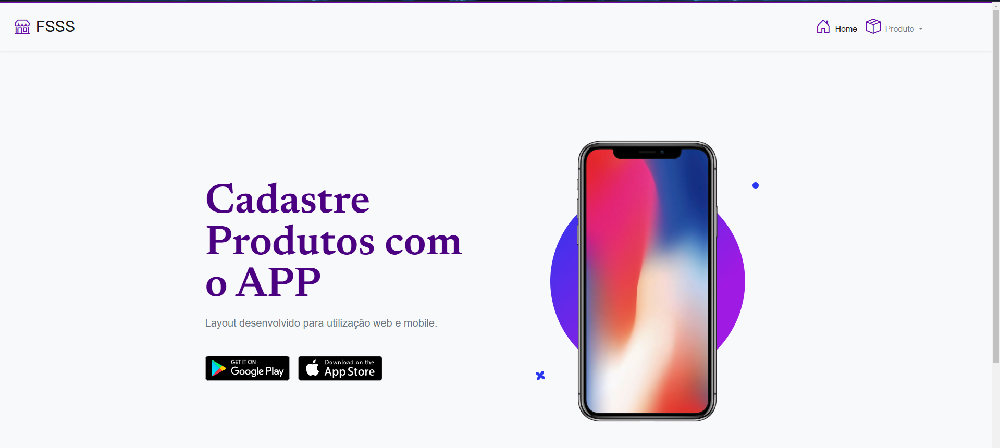
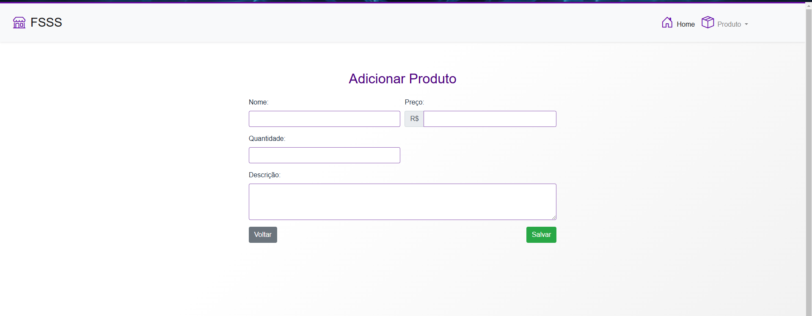
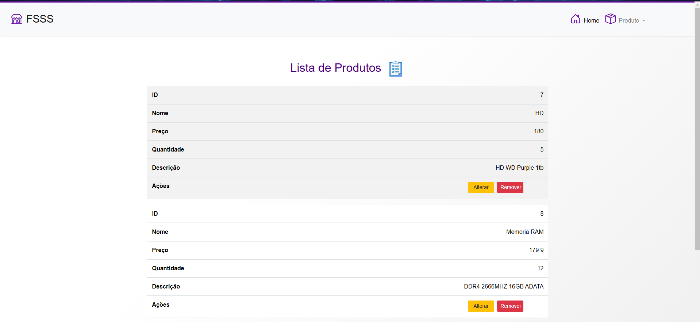

# CRUD Produtos - Golang

     

## Visão Geral

Este projeto é um **Sistema de Gestão de Produtos** desenvolvido para um trabalho da faculdade, no curso de **Sistemas de Informação**, para a matéria de **Programação Web**. O objetivo principal deste projeto é criar uma aplicação web básica para gerenciar um banco de dados de produtos, permitindo que os usuários adicionem, atualizem, excluam e visualizem produtos.

### Tecnologias Utilizadas

- **Frontend**: HTML, CSS, JavaScript, Bootstrap
- **Backend**: Golang
- **Banco de Dados**: SQLite

### Funcionalidades

- Adicionar novos produtos com nome, preço, quantidade e descrição.
- Atualizar produtos existentes.
- Excluir produtos cadastrados.
- Listar todos os produtos cadastrados.

### Telas

- **Tela Inicial**: Página de boas-vindas e navegação para as funcionalidades.
- **Tela de Cadastro**: Formulário para adicionar ou editar produtos.
- **Tela de Lista**: Visualização de todos os produtos cadastrados.

### Estrutura do Projeto

- **Frontend**: A aplicação utiliza HTML, CSS, JavaScript e Bootstrap para a construção das páginas.
- **Backend**: Implementado com a linguagem Go, responsável pela lógica de negócio e comunicação com o banco de dados SQLite.
- **Banco de Dados**: Utiliza SQLite para armazenar e gerenciar os dados dos produtos.

### Desenvolvido por

- **Carlos Henrique Silva Gonzaga**
- **Lucas Figueiredo Gonzaga**
- **Melissa de Souza Pereira**
- **Ronan Marques Cardoso da Silva**
- **Wesley Batista Santana**

### Imagens das Telas

#### Tela Inicial

#### Tela de Cadastro

#### Tela de Lista

